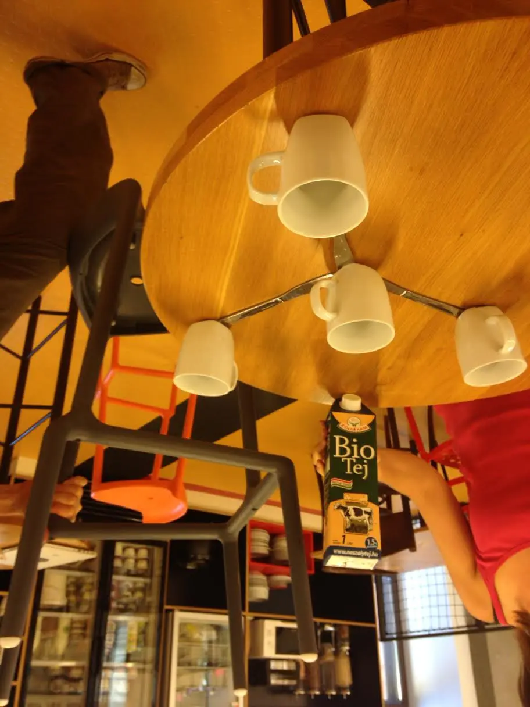

Gondolkodtam egy csomót, hogy mitől leszek én ismert egy olyan cégben, ahol van vagy 200-250 ember. (Jah, hát ide még nem írtam le, de már vagy három hónapja ismét a Preziben dolgozom.) Mert azt nem mondhatnánk, hogy túlságosan feltűnő jelenség vagyok. Omar haverom ma meg is jegyezte, hogy én néztem ki a leglustább/flegmább alaknak az egész cégben, aztán kiderült, hogy engem érdekel a legjobban az egész és mindig meglepem valami újjal (ma rajzoltam neki egy szülinapi tortát, mert láttam LinkedIn-en, hogy ma van). Jó hát én ilyen csendes lázadó vagyok, inkább gondolkodok mint beszélek, és meggyőzök egy hangadót, hogy aztán ő győzze meg a többieket helyettem. Nekem ez az aknamunka megy, na.

De visszakanyarodva, azt semmiképp nem szeretném, ha ne tudnák rólam, hogy ott vagyok, úgyhogy törtem a fejemet erősen. Aztán feltűnt a bisztróban egy üres whiteboard, amire soha nem írt senki. Naná, hogy felírtam rá a nine digites feladatot meg egy email címet. Sok megoldás érkezett, volt aki papíron számolta ki, volt Haskell is meg mindenféle. Úgy tűnt szeretik az emberek, úgyhogy az ötletből rendszer lett, és már kilenc hete írom fel a feladatokat.

Én azért szeretem, mert így megismerem a legjobb arcokat, a többiek meg azért, mert szeretnek hülyeségeken gondolkodni. Vagy legalábbis így gondolom. Volt már matekosabb és programozós feladat, meg olyan is, amiben késekből kellett hidat építeni. Tisztelt korábbi kollégáim nyilván emlékeznek rá a régi szép időkből.

Van vagy harminc tagja a levelező csoportunknak, és minden héten jön néhány megoldás is, de azért nem túl sok. Persze a lényeg úgyis az, hogy tudjam kivel érdemes haverkodni. HP meg is jegyezte, hogy majd belőlük alakítom ki a csapatomat. Hát igen, szegény kollégák még nem sejtik, hogy egy 50 részes interjúsorozaton vesznek részt...

Ezen a héten volt az az [OKTV feladat](https://csokavar.hu/blog/2012/12/diophantosz/), amit még tavalyelőtt itt a blogon is megírtam. Jövő hétre valami programozós jön, gondolom talán egy jópofa titkosírás. Kb 30 hétnyi anyagom van betárazva, úgyhogy idénre elég lesz. Aztán vagy sikerül bebootolni a dolgot vagy nem.

Hogy egy másik vonalon is erősítsek, jelentkeztem mentornak a [JUMP](http://jump.prezi.com/) programba. Itt majd frissen végzett és akörüli programozókat fogunk okítani fél éven keresztül. Kíváncsi leszek, mert sok mentorjelölt van, már a jumperek számához képest, és nem tudom hogy lesznek majd végül összekötögetve velük. Mindenesetre ez is egy olyan jóság lenne, ami amúgy is közel áll hozzám (ó hogy hányan utálhatnak azóta is a régi bevprogos csoportjaimból), meg valamennyire láthatóvá is tesz idebent.
