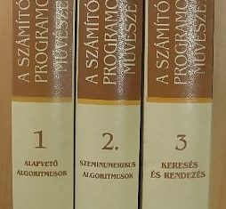

A héten ismét elkezdtem olvasni A számítógép-programozás művészetét Knuthtól. Emlékszem milyen viccesnek találtam, amikor először láttam ezt a könyvet 1998 körül az Akadémiai Kiadó győri boltjában. A programozás művészete, na ne... Persze ez még a háború előtt volt, nem sokkal mielőtt leérettségiztem, tehát lópikulát se tudtam a programozásról, meg arról, hogy ki a fene az Donald E. Knuth.

Aztán az egyetemen a műegyetemista haverjaim valahogy megtudták, hogy a mi jegyzetboltunkban van még belőle néhány példány, és mivel akkoriban már nagyon fogyóban volt, mi sem vehettünk, csak fejenként egyet belőle. Elsősként semmi szükségem nem volt rá, úgyhogy Lukács haveromnak ajánlottam fel a kvótámat. Sajnos csak a kettes és hármas kötet volt raktáron és csak kb. fél év múlva talált Tisza Gergő haverom egy antikváriumot, ahol még volt az első kötetből néhány darab. Nevetséges, hogy egy hatvanas évekbeli könyv az algoritmusokról harminc évvel később is így pörögjön.

Egy-két évvel később karácsonyra megvettem magamnak a Cormen–Leiserson–Rivest-féle Algoritmusokat, amit aztán elég hamar ki is végeztem. Knuth könyve teljesen eltűnt a boltokból, a sajátomat csak sok-sok év múlva találtam meg valahol a Vaterán. Elég kitartóan kerestem, mert én is ki akartam alakítani a Fekete tanár úrnál látott polc elrendezést a három Gyűrűk ura kötettel a Knuth könyvek mellett. Képes voltam emiatt hetente végignézni az internetet, hátha valaki épp most akar megszabadulni tőle. Aztán elkezdtem olvasni, de lepattantam róla. A szeminumerikus algoritmusok elég érdekes, de csak nem tudtam rászánni magamat komolyabban. Miután elvégezte az ember az egyetemet, és tud egy csomó mindent az adatszerkezetekről meg az algoritmusokról, nehezen veszi rá magát, hogy 1500 oldalt végigtoljon és kimazsolázza a használható, eddig ismeretlen részeket. Mert nyilván nem kell napi szinten a binomiális együtthatók mind a harminc legfontosabb átalakítási szabálya...

De ez mégiscsak egy kultikus könyv. Nincs statisztikám a legtöbbet hivatkozott könyvekről, de ez elég előkelő helyen lehet, úgyhogy nekivágtam még egyszer. Nem tűzök ki magam elé lehetetlen célokat, egyelőre maradjunk az első kötetnél. Hátradőlök a kis fürdőkádamban és olvasom (fáj a kib�szott seggem, úgyhogy sok időt töltök ott). Ha meg valami nem megy fejből, mert csak úgy hányaveti módon odaírta a bácsi, hogy innentől triviális, akkor előveszem a kis füzetkémet, és megpróbálom levezetni.

Azokat a jó kis analízis felkészüléseket juttatja eszembe... Egyszer, amikor egy képleten ültem fél délelőttöt, végül falhozvágtam a könyvet. Ez a differenciál formák kapcsán fordult elő a Stokes-tétel előtt valamivel. Ma már persze nem tudom, hogy mi a fene az a [Stokes-tétel](http://en.wikipedia.org/wiki/Stokes%27_theorem), csak annyi rémlik belőle hogy azon a környéken arról van szó, hogy bizonyos esetekben térfogati integrál helyett áttérhetünk felületi integrálra, felületiről meg vonalra. Ja és hogy ennek az egésznek van valami köze ahhoz, hogy a Föld belsejében a gravitációs erő a középponttól mért távolságal nem négyzetesen hanem lineárisan csökken, és hogy ugyanez a témakör fordul elő villanytanban a Maxwell egyenleteknél. De ha agyon ütnek se tudok róla most többet mondani.

Szóval a régi szép időket élem újra, és kezdem érteni, hogy került a könyv a Gyűrűk ura mellé Feketénél. Mindkét szerző ráérősen kalandozik a kis világában, és mindegyik ugyanúgy szerethető. Knuthnak ez gyakorlatilag az életműve, mérhetetlen munka van benne, és a mai napig dolgozik rajta. Az első három kötethez a teljes addigi irodalmat átnézte és szintetizálta. Ha már csak azt veszem, hogy később emiatt határozta el, hogy megírja a [TeX](http://en.wikipedia.org/wiki/TeX) nyelvet, amit azóta is minden tudós használ amikor publikációt ír... Te jó ég...

Most a matematikai alapok vége felé járok, a generátorfüggvényeknél. Szerencsére ezeket már megtanultam, amikor korábban rekurzív definícióval adott sorozatokra kerestünk explicit formulát (klasszikusan a Fibonacci sorozatra gondolhatunk, de akár a [függönycsipeszes](https://csokavar.hu/blog/2008/09/a-programozo-otthona/) problémát is vehetjük). Utána jön még egy algoritmus matematikai elemzése, aztán a MIX gép. Ez jó mókának igérkezik, tán csinálhatnék is egy MIX emulátort JavaScriptben...
