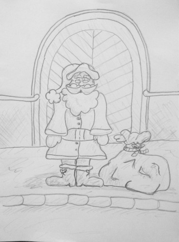

Nehogy azt gondolják, hogy kinőttem már a Mikulás rajzolásból. Most, hogy ekkora gyerekeim vannak kezdek belejönni igazán.

A minap volt egy teológiai vitánk Zsófival, amit a következő verhetetlen érvvel zárt le. "Oké apa, ha te nem hiszel Istenben, akkor én se hiszek a Télapóban." Hát erre most mit mondjak...

Mindenesetre ez nem az első mikulás témájú firkálmányom a csókaváron. 2007-ben is [rajzoltam](https://csokavar.hu/blog/2007/12/santa-kloz/) egyet, te jó ég az már nyolc éve volt...

Azóta nem sokat fejlődött a karakterábrázolás... Most a városban kaptam ceruzavégre, ezúttal Rudolf nélkül.

Be kell látnom, hogy nagyon nehezen megy az öregember rajzolás, ez kb a hatodik próbálkozás volt, és csak akkor lett igazán jó, amikor megnéztem a régi képet. Akárhogy próbáltam mindig túl fiatal lett a végeredmény. Talán a bajusz hiányzott, nem tudom. Pedig vettem is egy karikatúra rajzolós könyvet a nyáron, hogy ellessem a trükköket, de persze annyit nem gyakoroltam, hogy még most is jól menjen.
