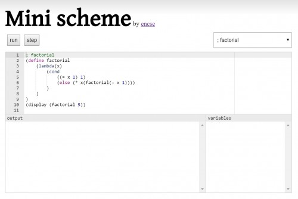

Nemrégiben fejeztem be két aranyos Scheme könyvet a Little Schemert, és a folytatását a Seasoned Schemert. Bár nem sok újdonságot találtam bennünk, mégis nagyon szerethetők, főleg az illusztrációk miatt.

Ami igazán megfogott benne, és végül rávettem magam egy kis munka utáni hobbi projektre, az a call with current continuation, vagy call/cc volt. Még sosem volt dolgom olyan nyelvvel, ami ezt a konstrukciót támogatná, pedig ezer dolgot lehet vele csinálni például returnt, kivételkezelést, lazy generátorokat, vagy akár threadeket is szimulálni.

Lényegében arról van szó, hogy készítesz egy blokkot, ami futáskor paraméterül megkap egy continuationnak nevezett függvényt. Ezt aztán elteheti magának későbbi felhasználásra, és amikor éppen arra támad kedve meghívhatja. Ekkor a vezérlés a blokk utáni lépéssel folytatódik. Valahogy úgy lehet elképzelni, mintha a continuationben eltárolnánk a call stacket meg a következő utasításra mutató instruction pointert, ezt odaadnánk a blokknak, és híváskor visszaállnánk az eltárolt állapotba.

Az érdekes az benne, hogy a continuationt eltehetjük egy változóba is, és tényleg bármikor, akár a blokkon kívülről meg szabad hívni.

Namost én már írtam néhány interpretert és compilert kisebb nyelvekhez, de ilyet még egyik se tudott csinálni, ráadásul idén nem volt semmi mini projektem se a csókaváron, szóval hogy úgy mondjam szüksészerűvé vált a dolog. És ha már ott vagyunk miért ne csináljam TypeScriptben, hogy egyből demozható is legyen, nem igaz? Na ez amilyen jól hangzik, akkora baromság volt, tekintve, hogy mekkora trágyalé ez az egész TypeScript fejlesztés, de ha már elkezdtem, végig is toltam. A projektek között [megtalálható](https://csokavar.hu/projects/mini-scheme), meg [githubon](https://github.com/encse/sicp) is akinek arra van gusztusa.

Az implementáció nem volt különösebben bonyolult, feltéve hogy valaki tisztában van a [continuation passing style](https://en.wikipedia.org/wiki/Continuation-passing_style)\-lal. Ahelyett, hogy magát a call/cc-t implementáltam volna meg ugyanis, egyszerűbb volt úgy megfogni a problémát, hogy minden utasítás paraméterként megkapja azt a continuationt, ami a program hátralevő részét értékeli ki. Így aztán, mondjuk egy értékadás előbb elvégzi a mellékhatásait, aztán csak meghívja a continuationt, hogy mehet tovább srácok.

Még egy trükköt vetettem be, hogy a klasszikus debugger funkcionalitást (break, step, continue) is hozzáadhassam a demóhoz, és futás közben kényelmesen írhassak log üzeneteket is egy div-be. Az egész kiértékelést vezérlő BaseEvaluator bizonyos számú lépés után ahelyett, hogy meghívná a continuationt, visszaadja azt az editornak mint részeredményt. Itt aztán frissítjük a UI-t, lekezeljük az eseményeket és hagyjuk egy kicsit fellélegezni a böngészőt, hogy aztán egy window.setTimeout-ban egy pillanattal később folytassuk az egészet.

A példák között vannak klasszikusak (faktoriális, 8 királynő) és a wikipediáról kimásolt call/cc demók is. Nem mondanám, hogy teljes core libraryt csomagoltam mellé, inkább csak olyan ahogy esik úgy puffan alapon vettem fel néhány függvényt aritmetikai és logikai műveletekre, meg listakezelésre.
