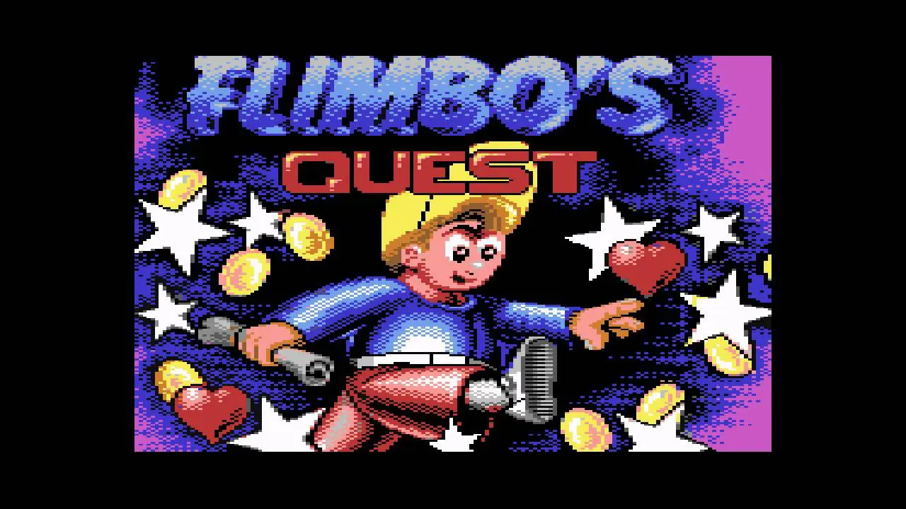
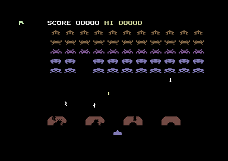
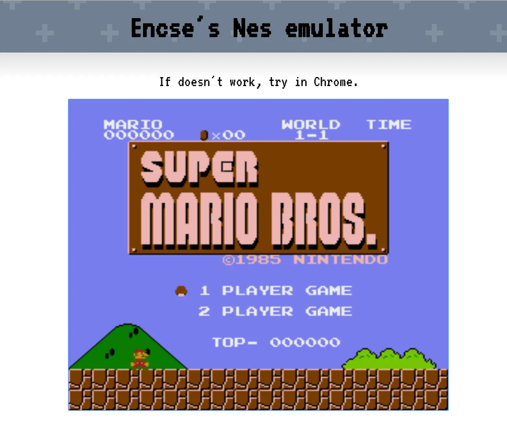

Januárban megint rám jött a hmm... 'csinálhatnék', és valami oknál fogva pont egy Nintendo emulátor mellett döntöttem. Beugrottak a Dévényi Tibi bácsi-féle Nintendo játékok, és hogy minden délután nyálcsorgatva néztük a tévén, ahogy a Czigány család Super Mario Brosozik. Nekünk nem volt NES-ünk, és nem is játszottam igazi gépen soha.

[youtube src="8LJwRnfRs2g"]

De jó húsz évvel később, már elég tökös gyereknek tartom magam ahhoz, hogy megcsináljam házilag. Megmutatom annak a kis geek 12 éves énemnek, hogy igenis megírom. Ha most lenne egy időgépem vissza is küldhetném neki, hadd játszon vele. Bár igazából mi évekig jól elvoltunk a Flimbo's Questtel. Sőt, az talán még jobb is volt, és főleg pokoli nehéz. Bár abban nem vagyok biztos, hogy a flimbós korszak egybe estett az Elektor kalandorral, mert C-64-et is csak viszonylag későn kaptunk, amikor a többi osztálytársam már inkább a PC-felé kacsintgatott.

Mindenesetre ezek voltak az évek, amikor esténként öcsémmel Columbot néztünk, meg pankrációt (Yokozuna vs Tatanka) és vasárnap a Balu kapitány ment a Disney családi mozidélutánban. Csak hétvégente lehetett számítógépezni, mert amúgy f�szságokat kellett bemagolni Gőcének irodalom órára. Aztán persze szénné játszottuk azt a néhány játékot. Nem volt sajnos floppynk, ezért magnóval kellett szórakozni, fejet állítgatni meg hasonló bohócságok. A korosztályom még emlékszik, de már most tele vagyok olyan tejfölösszájú kollégákkal, akik már a Windows 95 után voltak gyerekek. Ezek már talán azt se tudják miért C meghajtó a C meghajtó. B-t meg nem is láttak. Na ne szórakozzunk már...

Akkoriban kezdtem tanulgatni a programozást is. 10 évesen írtam az első Hello World-öt, de az hogy programozó leszek, szerintem már kicsit korábban eldőlt. Nagyjából három éves lehettem, amikor először láttam számítógépet, volt (van) egy VIC-20-asunk, amiről el sem tudom képzelni, hogy tudták megvenni a nyolcvanas évek elején. Mármint nem anyagilag, hanem egyáltalán. Akkoriban nem lehetett csak úgy áthozni ilyet a határon. Amikor először láttam, a szüleim egy ehhez hasonló Space invaders klónnal játszottak.

A képekre annyira nem emlékszem, főleg, hogy fekete fehér tévén láttam, de azt a kisgyerek számára hátborzongató hangját most is fel tudom idézni. Azt mondanám, hogy itt el is dőlt a pályaválasztás. Nem húztam sokáig, és tényleg ez az egyik legkorábbi emlékem, amennyire vissza tudok tekerni. Jó, annyira nem vagyok elveszett ember, van egy rakás nem geek dolog is. Fura, hogy mennyi minden megmaradt. Szerencsés vagyok, mert négy évesen Győrbe költöztünk (Anyu, az egy másik ország?), és így be tudom lőni, hogy mi történhetett három éves koromban vagy korábban.

A szüleim válása után hozzánk került a VIC-20. Igazából apukám elvitte, de mi aztán elhoztuk tőle öcsémmel. Egy szép fehér táska is volt hozzá Commodore logóval. Megszereztük a gépet és a kis fehér Junosztyon kezdtem pötyögni a programokat. Egyetlen könyvünk volt csak (máig becsben őrzöm), és negyedikes koromban állt össze a kép, hogy mégis miről van szó. Onnantól aztán tényleg nem volt megállás. Később jött a C-64, amiből már grafikát is elő tudtam csalni 320x200-as felbontással, és persze spriteokkal. De itt is folyamatosan információ hiánnyal küzdöttem, mert ehhez se volt túl sok könyvünk, és nekünk nem járt a Commodore Világ sem, amiben mindig volt egy csomó trükk, amit persze az osztálytársaim mind előttem tanultak meg, hogy aztán felvágjanak vele. Így aztán sosem tanultam meg a MOS 6510-es assembly nyelvét, és a mai napig nem tudom mi hogy működött benne igazán.

És ezzel egy másik vonalon is elérkeztünk a NES projekthez: az akkor kielégítetlen tudásvágy sem hagyott nyugodni, hogy egyszer az életben tényleg megérthessem hogy mentek ezek a dolgok annak idején.

Tehát amíg Enikő a diplomamunkáját írta (írja), én esténként a [nesdevet](http://wiki.nesdev.com/w/index.php/Nesdev_Wiki) olvasgattam, és megpróbáltam a fórum hozzászólásokból és a pontatlan leírásokból összerakni egy működő emulátort. Ezt most már akár Önök is [megnézhetik](https://nes.csokavar.hu/), igaz csak Chromeban. Valószínűleg meg lehetne oldani, hogy a többi böngészőn is elfogadható legyen, na de mekkora májerság már, hogy egyáltalán működik! És nincs hangja. Tudom.

Mindenesetre én nagyon örülök neki. A tizenéves kicsi én biztos nagyon büszke lenne rám, és olyan akarna lenni mint én, ha felnő. Legalább nem okoztam csalódást neki.

