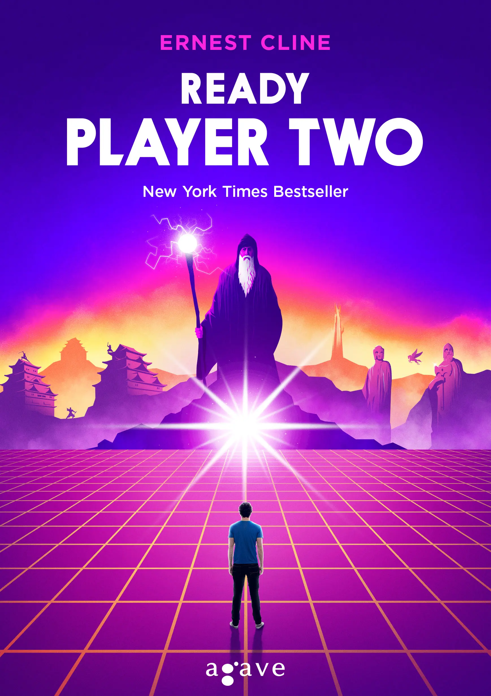

Szülinapomra megkaptam a Ready Player Two-t, Ernest bácsi legendás könyvének [folytatását](https://csokavar.hu/blog/2013/09/ready-player-one/).

Hozza az első részből megismert kulturális referencia cunamit. Minden ami 80-es évek, film, zene, játék, könyv. Egyes szerzőknek, előadóknak egész bolygókat és bolygórendszereket szenteltek az OASIS megalkotói, és részletes bemutatást kapunk mindenről. Kicsit olyan Umberto Eco jellege van az egésznek, végtelen felsorolás, és lexikonnal kellene olvasni… De Ernest Clientól ne várjunk egyediséget, pont az a lényege, hogy meglevő elemekből építkezve mutat be világokat. Mindent láttunk-hallottunk már, amiről szó van, a retro hangulat viszi hátán az egészet. 

A könyvet azért hamar kivégeztem, mert a történet megint egy versenyfutás volt és érdekelt, hogy mi következik. 

Kíváncsi voltam mi lesz az első rész után, hogyan birkóznak meg Wade-ék a hirtelen jött gazdagsággal, ismertséggel és hatalommal, fel tudnak-e nőni a feladathoz. Ebből a szempontból jól teljesít, és a végén egyfajta lezárást is kapunk, bár ahogy Econál, a történet Clinenál is csak díszlet.

Azért a végére támadt egy ötletem, és az about pagembe én is elrejtettem egy easter egget. Kíváncsi vagyok megtalálja-e valaki :)
