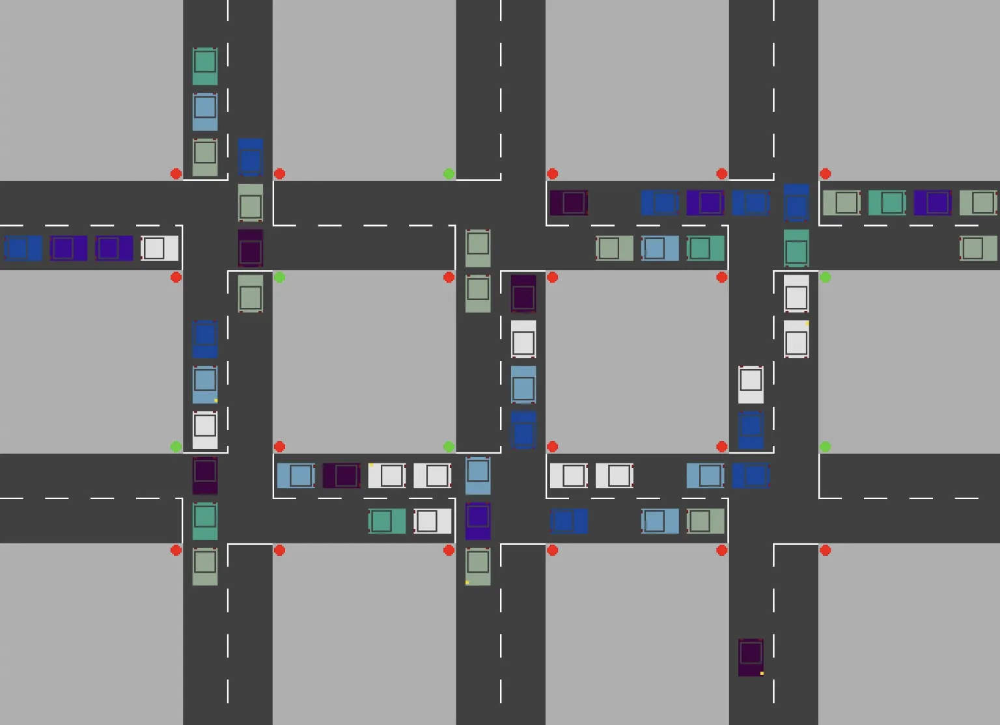

Készítettem egy mini 404 oldalt ide a csókavárra. Valójában egy pici szöveges kalandjátékról van szó. A sima statikus hibaoldal elég unalmasnak tűnt, meg mindig is ki akartam próbálni, hogy kell ilyet készíteni. Tetszőleges, amúgy nem létező url-en elérhető, de az egyszerűség kedvéért van egy kanonikus alakja is: [404.csokavar.hu](https://404.csokavar.hu). Telepakoltam popkulturális referenciával, de kell egy kicsit próbálkozni, hogy minden előjöjjön.

Ezzel már a harmadik retró marhaságot adtam hozzá az oldalhoz. Az első a finger protocol implementáció volt, ami egyébként közvetlenül böngésző dev consoleában is elérhető, nem csak a `finger @csokavar.hu`-val. A második pedig tavaly került az about oldal fejlécébe. Ha valaki a játékgépekre kattint, egy javascriptes pac-man játék ugrik elő. Csak desktopon működik, mert az irányítás nem tetszett mobilon.

Mostanában a legtöbb mini projektemet GitHub Pagesen tárolom, mert végtelen kényelmes, hogy elég csak pusholni a repóba, ha deployolni akarok. Sajnos a csókaváron még nem jutottam el a fejlettségnek erre a magas fokára, ugyanis mindenképp ragaszkodom az apex domainhez, tehát hogy mindenféle előtag nélkül elérhető legyen az oldal, ne kezdődjön mondjuk www-vel. De ha ilyet akarok, akkor macerásabb a GitHub Pages, és végül legutóbb valami miatt elvetettem. Ennél mélyebb integrációt meg a lustaságom miatt nem csinálok, szóval marad a kézi vezérlés. Nem mintha túl gyakran változna itt bármi :)

Egész hosszú a listája a soha ki nem blogolt, de elkészült projekteknek. Kikukáztam például az ezer éves [Rubik kockás](https://rubik.csokavar.hu) munkámat, amit még DOS-ban készítettem gyerekkoromban. Megtaláltam a szintén egyetemi "városos beadandó" forrását is, sőt elindítani is sikerült, de azt még egyelőre nem csomagoltam össze. Pedig milyen jó kis történelmi kutatómunka volt... Az ezer éves szarságokat lementettem a caesar.elte.hu-ról ~~még mielőtt elvesztettem a kulcsomat~~... Uhh te jó isten még mindig be tudok lépni! Sürgősen bezárom mielőtt rám szabadítják a TEK-et. Van/volt itt sok levél, meg egy-két régi program vagy házi feladat amikkel akkoriban szórakoztam.

Hát nem gyönyörű? Hát nem. Olyan libek vannak benne hogy csuda. Meg gcc-ből is múlt századit igényelt.

Tavaly a covid alatt leültem assemblyben [Mandelbrot halmaz](https://mandelbrot.csokavar.hu) rajzolókat készíteni. Nyilvánhogy C64-hez a kihívás kedvéért, meg x86-hoz, mert nekem ne mondja senki hogy nem tudok bootloadert írni...

A múltkor Maya talált egy feladatot ami arról szól, hogy ha van két oszlop amik között kifeszítünk egy kábelt, akkor az milyen mélyen fog belógni a közepén. Ehhez készítettem egy kis [vizualizációt](https://hanging-cable.csokavar.hu) valamelyik hétvégén.

Sikerült elég jó eredményt elérni az idei CrySys Labos security versenyen. Mondjuk annyira nem csillog, mert a mezőny nem volt túl erős, de a feladatok között volt pár érdekes, és szerintem elég jó [writeupokat](https://github.com/encse/secchallenge2022) készítettem hozzájuk. Idén már harmadszor voltam, tavaly mindent megcsináltam, volt ami hetekig tartott...

Felélesztettem a [gekkót](https://gekko.csokavar.hu) is, amit pár évvel ezelőtt egy óvatlan PHP frissítés tönkretett, és nem volt kedvem helyrehozni, főleg, hogy a kutya nem játszik vele. De idén rendesen kitanultam a `docker-compose`-t, és ha már ott volt, akkor bekonténereztem a gekkót. Van benne jópár, mert az egyes pályák is külün konténereket kaptak. Ma már a csókaváron nincs is PHP, csak bedobozolva, úgy meg nem fáj (annyira). 

Így mulatok, ha időm engedi. Ezekből a kis szarokból már annyi van, hogy mikor tavaly állást keresetem, mindig tudtam valami mini "code behindot" hagyni magam után az interjúk végén. Ha más nem, erre jók. Nyilván komoly dolog nincs közte, ez csak a szórakozás. A GitHubomat nézegetve arra jöttem rá, hogy engem a retro programozás érdekel, nem ezek az újhullámos dolgok, arra ott a munkaidő. 
