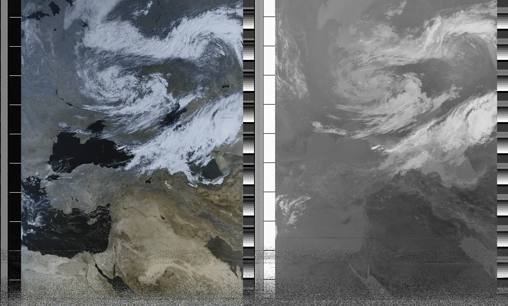
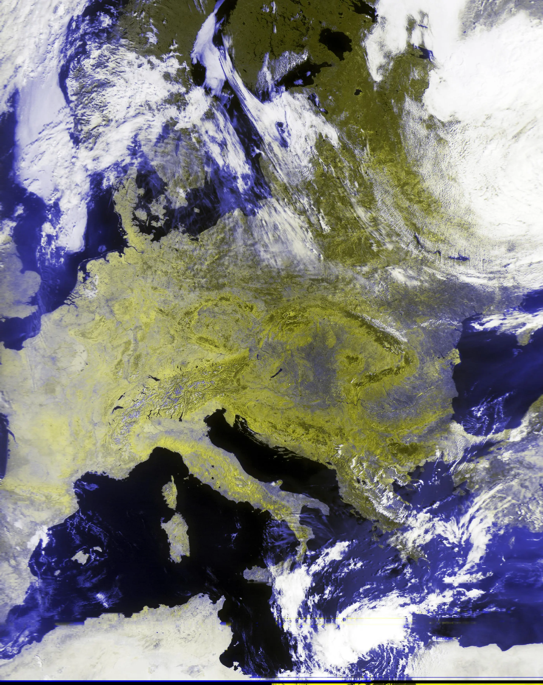
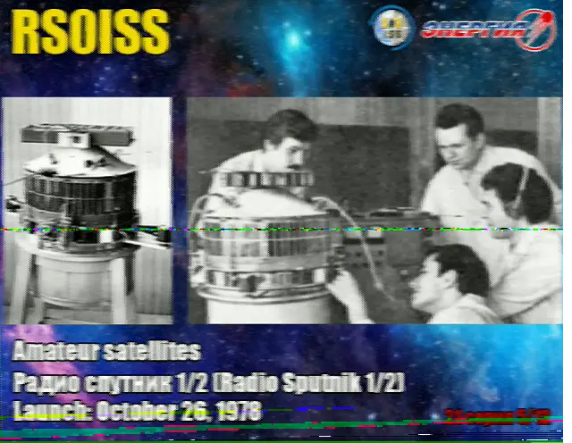
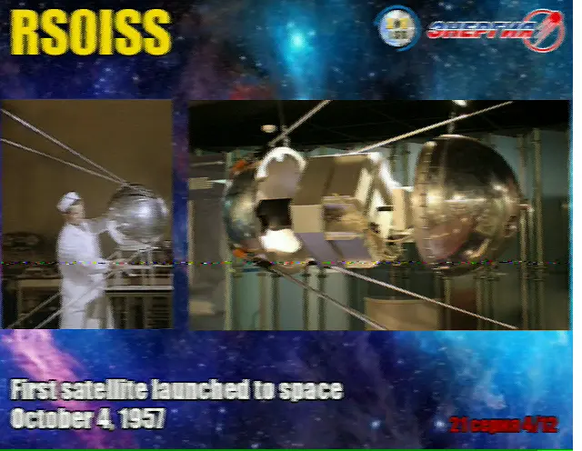

2023-ban rákaptam a Software Defined Radióra. Vettem egy RTL-SDR v3 donglet, és az egész hétvégét 
átjátszottam vele. Hallgattam a repülésirányítást, aztán találtam egy rádióamatőr átjátszóállomást a 
környéken, és azon keresztül néhány amatőr beszélgetést.

Dekódoltam amit találtam (morse, RTTY, ADS-B), de legjobban a műholdazás érdekelt. Mint kiderült, a 
mai napig van néhány olyan meteorológiai műhold, ami egy végtelen hosszú filmet/képet küld arról amit 
éppen maga alatt lát, mint valami űrbeli scanner. Egész kis közössége van ezek gyűjtögetésének. A 
legjobb pedig, hogy az ember hamar megismerkedik egy-két antenna fajtával, olyan fogalmakkal mint az 
LNA meg a T-Bias, meg a különféle kódolásokkal, amiket ezek a műholdak használnak.

Két családról beszélhetünk jelenleg, az amerikai NOAA és az orosz Meteor műholdakról. Úgy kell 
elképzelni, hogy ez a 3-4 műhold naponta néhányszor elrepül az ember feje fölött, és ha éppen akkor 
kint áll a kertben és az antennájával ez ég felé mutogat, akkor 137.5 Mhz környékén mindenféle 
csipogást hallhat. A műholdak fekete-fehérben küldik a képet, de több hullámhosszon is fényképeznek, 
így ki lehet belőle keverni valami RGB-t, úgyhogy a végeredmény ilyesmi lehet:

Ami azért nem rossz egy darab dróttal a kert végéből. Tulajdonképpen ez csak a belépő szint, profibb 
felszereléssel még ennél is jobb eredmény lehet elérni, vagy több műholdat befogni, de ahhoz már 
parabola antenna is kellene, praktikusan egy forgató motorral.

Egy másik érdekes projekt lehet az űrállomás hallgatása. Néha előfordul, hogy az űrhajósok 
iskolásokkal beszélgetnek, amibe kis szerencsével bele is lehet hallgatni. Legalábbis a válaszokba, 
a kérdéseket mi nem tudjuk fogni.

[video src="files/iss.mp4"]

Máskor SSTV adásokat küldenek, éppen ezen a hétvégén indul egy pár napos session. Az SSTV 
tulajdonképpen csak egy képet jelent, nem igazi TV, jellemzően az orosz űrkutatás nagy pillanataiból 
kapunk néhány bélyegszerű izét. Rém ronda, de jó mulatság összevadászni, kicsit olyan mint a 
horgászat, sok türelem, és a végén a fene tudja mit jön ki belőle.

Persze SSTV adást bárki küldhet, akinek van rádióamatőr engedélye, és a 14.230 Mhz-es frekvencián 
folyamatosan megy is az adok-kapok. Hogy a csokavar se maradjon ki belőle, ideteszek egy kis easter 
egget. Ezt multimode cocoával készítettem, de akármelyik sstv dekóder tudja olvasni. Segítségképpen 
elárulom, hogy Scottie S4 formátumot használtam hozzá, bár anélkül is ki lehet találni egy kis 
próbálkozással.

[sstv](files/sstv.mp3)

Elkanyarodva az űr témától, elég könnyű belefutni hamburgiból sugárzott hajózási térképekbe (wefax), 
esetleg teletype időjárás előrejelzésekbe.

[gallery]
images/map.webp
images/map2.webp
images/map3.webp
images/map4.webp
[/gallery]

Ezzel persze még nincs vége, elkezdtem antennákat, szűrőket építeni. Vettem egy másik RTL SDR-t, ami 
jobban működik alacsony frekvencián, és egy mágneses hurokantennát is. 

Szereztem valahonnan egy old school változtatható kapacitású kondenzátort, germánium diódát,
tekercset, egy erősítő IC-t, és készítettem egy kristály rádiót. Egy 10m hosszú vezeték fut körbe a 
padláson, az az atennája, egy másikat meg rákötöttem a radiátorra földelésnek. De nagyon szépen bejön 
rajta a Kossuth Rádió. Tulajdonképpen azon kell izmozni, hogy ne a Kossuth szóljon belőle. 

[video src="files/crystal.mp4"]

Később FM rádiót is készítek majd, és egyszer talán leteszem a rádióamatőr vizsgát, de az még kicsit 
odébb lesz.

